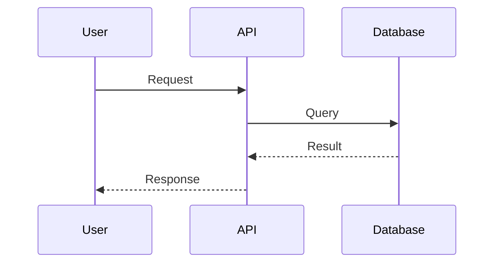
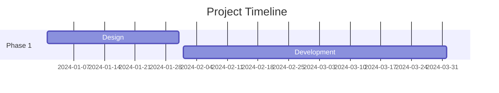

# Presentation Content Guidelines

## Overview
Guidelines for creating effective presentation content, including component usage, sizing, and layout preferences.

## Title Sizing

### Use Cases by Variant

**`heading` variant** - Large titles (text-5xl to text-7xl)
- Hero slides
- Title slides  
- Major section dividers
- Opening/closing statements
- Use when the title IS the content

**`subheading` variant** - Medium titles (text-2xl to text-3xl)
- Secondary hero content
- Section introductions
- Important callouts

**`title` variant** - Compact titles (text-base to text-lg)
- Content slides with diagrams
- Content slides with charts
- Content slides with code blocks
- Content slides with tables
- Use when you need room for actual content below

**`caption` variant** - Small text (text-xs to text-sm)
- Image captions
- Diagram annotations
- Footnotes

**`body` variant** - Body text (text-sm to text-base)
- Markdown content
- Explanatory text
- Lists and paragraphs

### Examples

```typescript
// ❌ BAD: Using massive heading on a diagram slide
{
  type: 'text',
  content: 'System Architecture',
  variant: 'heading'  // Too big! Leaves no room for diagram
}

// ✅ GOOD: Using compact title on a diagram slide
{
  type: 'text',
  content: 'System Architecture',
  variant: 'title'  // Perfect size for content slides
}

// ✅ GOOD: Using heading for hero slide
{
  type: 'text',
  content: 'Welcome to Our Platform',
  variant: 'heading'  // Great for hero/title slides
}
```

## Mermaid Diagrams

### Orientation Preference

**PREFER HORIZONTAL (LEFT-TO-RIGHT) LAYOUTS**

Horizontal diagrams work better on wide screens and are easier to read in presentation format.

### Flowcharts

```mermaid
# ✅ GOOD: Horizontal flowchart (LR = Left to Right)
flowchart LR
    A[Start] --> B[Process]
    B --> C[End]

# ❌ AVOID: Vertical flowchart (TD = Top Down)
flowchart TD
    A[Start] --> B[Process]
    B --> C[End]
```

### Sequence Diagrams

Sequence diagrams are naturally horizontal - use them as-is:



### State Diagrams

```mermaid
# ✅ GOOD: Horizontal state diagram
stateDiagram-v2
    direction LR
    [*] --> Idle
    Idle --> Processing
    Processing --> Complete
    Complete --> [*]

# ❌ AVOID: Vertical state diagram (default)
stateDiagram-v2
    [*] --> Idle
    Idle --> Processing
    Processing --> Complete
    Complete --> [*]
```

### Graph Diagrams

```mermaid
# ✅ GOOD: Horizontal graph (LR)
graph LR
    A[Frontend] --> B[API Gateway]
    B --> C[Service 1]
    B --> D[Service 2]

# ❌ AVOID: Vertical graph (TD)
graph TD
    A[Frontend] --> B[API Gateway]
    B --> C[Service 1]
    B --> D[Service 2]
```

### Entity Relationship Diagrams

```mermaid
# ✅ GOOD: Horizontal ER diagram
erDiagram
    CUSTOMER ||--o{ ORDER : places
    ORDER ||--|{ LINE-ITEM : contains
    PRODUCT ||--o{ LINE-ITEM : "ordered in"
```

### Class Diagrams

For class diagrams with many classes, prefer horizontal layout:

```mermaid
# ✅ GOOD: Horizontal class diagram
classDiagram
    direction LR
    class User {
        +String name
        +login()
    }
    class Admin {
        +manageUsers()
    }
    User <|-- Admin
```

### Gantt Charts

Gantt charts are naturally horizontal - use them as-is:



## Content Slide Layout

### When to Use ContentSlide Component

Use `content-slide` component when you have:
- A title/header
- Multiple sections of content
- Need for column layout
- Diagrams, charts, or code with context

```typescript
{
  type: 'content-slide',
  header: {
    title: 'System Architecture',  // Automatically sized appropriately
    subtitle: 'Microservices Design'
  },
  layout: '2-column',
  content: [
    [
      // Left column: diagram
      {
        type: 'mermaid',
        diagram: 'flowchart LR\n    A-->B'
      }
    ],
    [
      // Right column: explanation
      {
        type: 'text',
        content: 'Key components...',
        variant: 'body'
      }
    ]
  ]
}
```

### When to Use Individual Components

Use individual components for:
- Full-screen diagrams
- Hero slides
- Simple single-focus content

```typescript
// Full-screen diagram
{
  type: 'mermaid',
  title: 'System Architecture',  // Optional small title
  diagram: 'flowchart LR\n    A-->B'
}
```

## Best Practices

### 1. Match Title Size to Content Density

- **Low density** (hero, title slides): Use `heading` or `subheading`
- **High density** (diagrams, code, tables): Use `title` or no title

### 2. Prefer Horizontal Layouts

- Flowcharts: Use `LR` (left-to-right)
- State diagrams: Add `direction LR`
- Graphs: Use `graph LR`
- Class diagrams: Add `direction LR` when many classes

### 3. Keep Diagrams Simple

- Maximum 5-7 nodes per diagram
- Use clear, concise labels
- Avoid deeply nested structures
- Split complex diagrams into multiple slides

### 4. Use Appropriate Spacing

- Give diagrams room to breathe
- Don't cram too much on one slide
- Use multi-column layouts for context + diagram

### 5. Consider Screen Aspect Ratio

- Presentations are typically 16:9 (wide)
- Horizontal layouts utilize space better
- Vertical diagrams waste horizontal space

## Examples

### ❌ BAD: Vertical diagram with huge title

```typescript
[
  {
    type: 'text',
    content: 'Our Microservices Architecture',
    variant: 'heading'  // Too big!
  },
  {
    type: 'mermaid',
    diagram: `flowchart TD
      A[API Gateway] --> B[Service 1]
      A --> C[Service 2]
      A --> D[Service 3]`  // Vertical!
  }
]
```

### ✅ GOOD: Horizontal diagram with compact title

```typescript
{
  type: 'content-slide',
  header: {
    title: 'Microservices Architecture',  // Appropriately sized
  },
  layout: '1-column',
  content: [[
    {
      type: 'mermaid',
      diagram: `flowchart LR
        A[API Gateway] --> B[Service 1]
        A --> C[Service 2]
        A --> D[Service 3]`  // Horizontal!
    }
  ]]
}
```

### ✅ BETTER: Horizontal with context

```typescript
{
  type: 'content-slide',
  header: {
    title: 'Microservices Architecture',
    subtitle: 'Request Flow'
  },
  layout: '2-column',
  content: [
    [
      {
        type: 'mermaid',
        diagram: `flowchart LR
          A[API Gateway] --> B[Service 1]
          A --> C[Service 2]
          A --> D[Service 3]`
      }
    ],
    [
      {
        type: 'text',
        content: `**Key Benefits:**
- Independent scaling
- Technology flexibility
- Fault isolation`,
        variant: 'body'
      }
    ]
  ]
}
```

## Summary

1. **Title sizing**: Use `title` variant for content slides, `heading` for hero slides
2. **Mermaid orientation**: Prefer horizontal (`LR`, `direction LR`)
3. **Layout**: Use `content-slide` for structured content with headers
4. **Simplicity**: Keep diagrams simple and focused
5. **Spacing**: Give content room to breathe

These guidelines ensure presentations are readable, professional, and make effective use of screen space.
